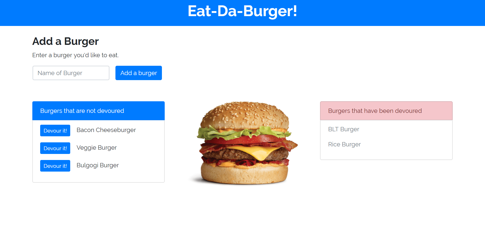
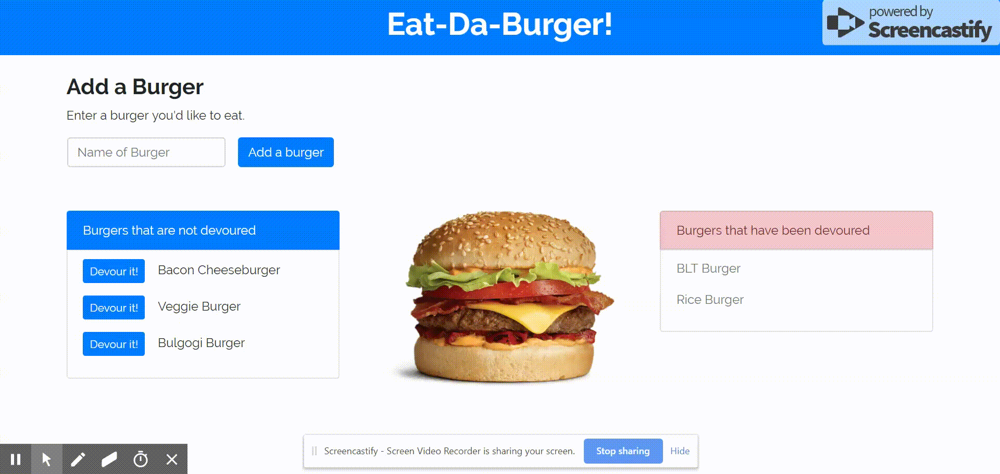

# Burger App: Eat-Da-Burger!

# Project Description

"Eat-Da-Burger!" is a full-stack application that follows the MVC design pattern. It is a restaurant app that lets users input the names of burgers they'd like to eat. Each burger in the waiting area ("Burgers that are not devoured") has a "Devour it!" button. When the user clicks the button pertaining to the desired burger, the burger will move to the right side of the page into the "Burgers that have been devoured" section. There is also an input section that allows a user to enter the name of a burger he or she would like to eat. Clicking the "Add a burger" button puts the burger in the waiting area, waiting to be devoured. Every burger is stored in the database, whether devoured or not.

This burger logger uses MySQL, Node, Express, Handlebars, and a homemade ORM. Bootstrap is used on the front-end for the design. The font used ('Raleway') comes from Google Fonts.

# Technologies Used

* Express.js
* Node.js
* Handlebars
* MySQL
* A homemade ORM
* AJAX/APIs
* jQuery
* Bootstrap
* CSS
* HTML

# "Eat-Da-Burger!" Live Link

"Eat-Da-Burger!" is deployed to Heroku. Please check it out here:

https://radiant-island-72390.herokuapp.com/

# Screenshots

